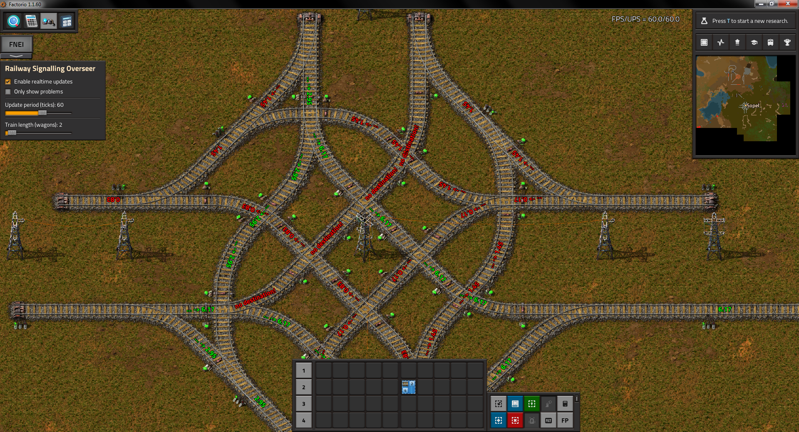

# Railway Signalling Overseer

This is a mod for factorio that checks the visible railway in realtime and checks whether the signal placement is correct. It detects:

- when a chain signal has no destination
- when a train would wait on chain signal indefinitely due to the train being on the same block it is waiting for clear up
- when any block a train on a chain signal could wait for to clear has insufficient length

**NOTE: The mod works only with single directional rails.** If there are rails that function in both directions the result is undefined. This behaviour will likely not change in the future.

## How it works

First it gets all rails in the players visible area (using an upper bound as there is no way to get the precise visible area). Then it identifies rails that have rail signals (or station) attached, and infers the traffic direction for these rails. From these rails a graph is expanded to cover enough railway to produce a result (around 2-3 blocks past the last visible chain signal). This graph is then turned from rail graph into a segment graph, to allow a more efficient look at the railway. Finally, traversals and block discovery algorithms are performed to find chain signal and block relations - this is where the problems are identified. The results are rendered on the surface. The graph formation and issue identification steps are done in separate ticks to reduce the lag spikes for denser areas.

## Preview

### Incomplete 4-way intersection

## Known issues

- sometimes produces incorrect results when a station is placed on a rail split
- can be slow, however it's unclear right now how to optimize this further

## Known NOT issues

- The direction of the text rendered on rails always follows the direction of the traffic on a given segment. If you have trouble reading upside-down text this is a perfect opportunity to learn that skill. This will not change.